# Отчет по 3 лабе
Выполнили: Зеленин Денис, Чебан Евгений или Илья, Миша, Прокопец Семен

### Часть 1. Поднимаем Postgres

1. Создаем директорию для работы и все нужные файлы, после чего билдим контейнеры   
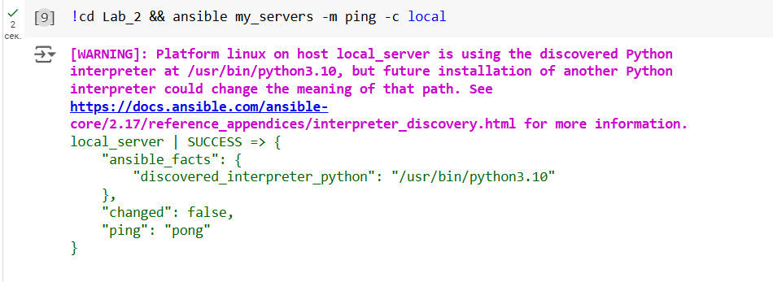

2. Проверяем, что `pg-slave` стал лидером, а `pg-master` — репликой.   
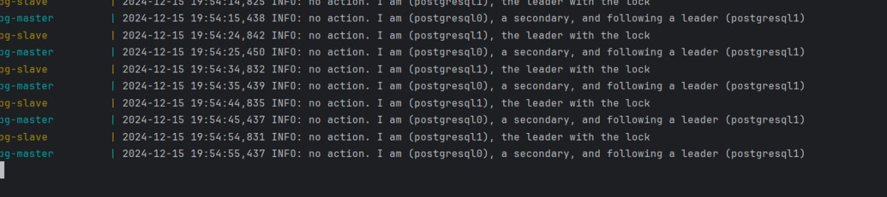

### Часть 2. Проверяем репликацию

1. Подключаемся к базам данных через pgAdmin по localhost и их портам   

2. Cоздаем таблицу `cars` с тестовыми столбцами и данными в `pg-slave`   
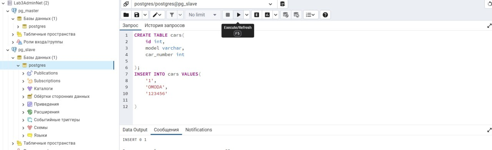

3. Видим, что в `pg-master` создалась таблица `cars`, которая содержит такие же данные   
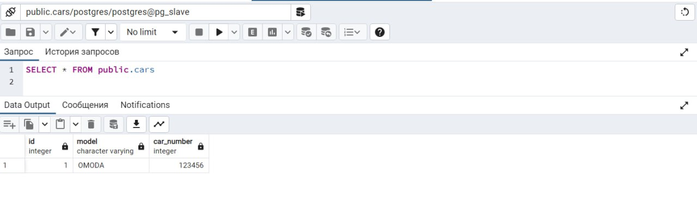

4. Также пробуем что-то изменить в таблице у `pg-master` и закономерно получаем ошибку, так как она в read only   
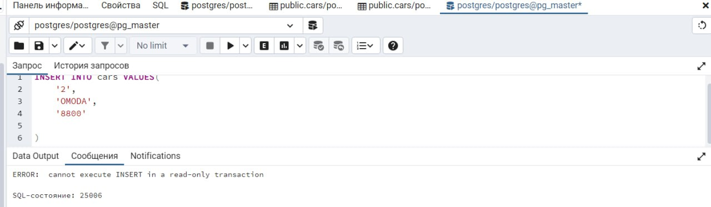

### Часть 3. Делаем высокую доступность
Для балансировки трафика нам нужен  балансировщик. Используем HAproxy
1. Создаем конфиг и меняем docker-compose  
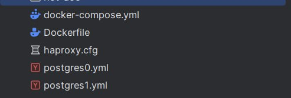
2. Успешно подключаемся к `haproxy`   
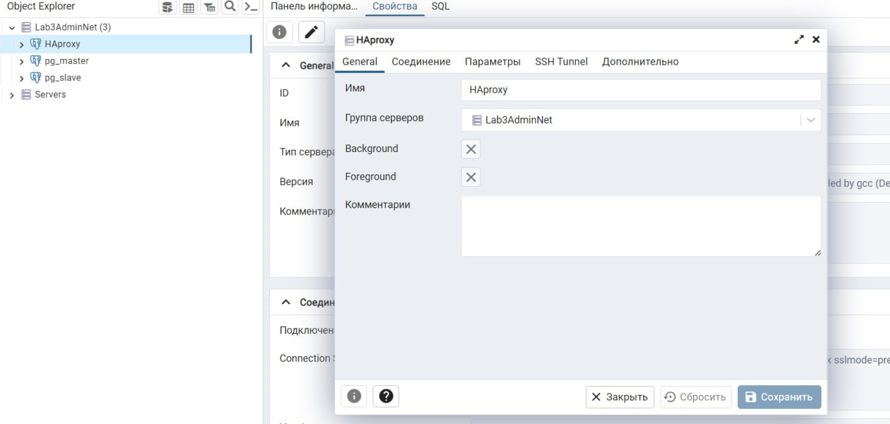

### Часть 4. Задание
1. Выключаем  контейнер pg-slave, который сейчас является мастером. Смотрим логи pg-master, postgres_entrypoint и zoo.
2. зукапер заметил, что что-то не так  
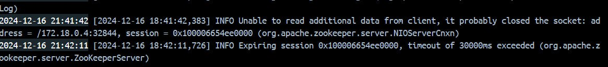
3. Haproxy понял что Мастер упал   
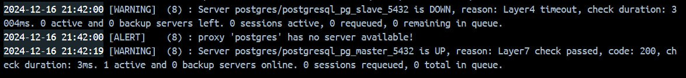
4. pg-master замечает отвалившийся коннект и пытается установить повторное подключение с мастером  
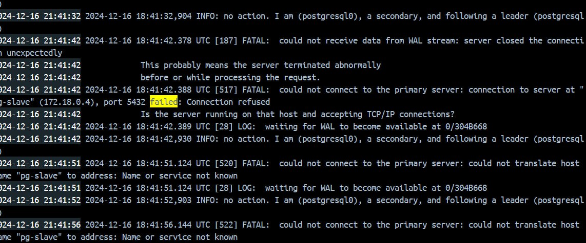
5. Видим что теперь наш мастер изменился
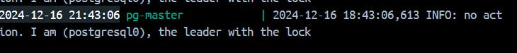
6. Чекаем ентрипоинт в бд. Подключение есть, база доступна, запись возможна.  
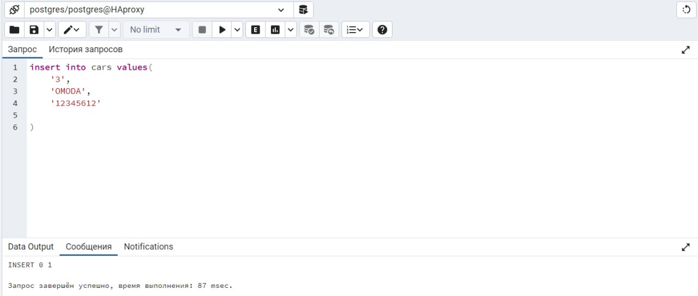
Когда мастер-нода вышла из строя, Patroni несколько раз пытался восстановить соединение. После исчерпания попыток он назначил реплику новой мастер-нодой. HAproxy также зафиксировал сбой и перенаправил запросы на нового мастера. Система автоматически справилась с проблемой, обеспечив работу базы данных: чтение и запись доступны, но запросы теперь обрабатываются другой нодой.

# Ответы на вопросы

## Разница между директивами `expose` и `ports` в Docker Compose

### Директива `expose`
- Позволяет сделать порты доступными только для других контейнеров в той же сети Docker Compose. Это значит, что сервисы могут взаимодействовать друг с другом, но доступ извне (например, с хост-машины) не предоставляется.
- Используется для внутренней связи между контейнерами, что может быть полезно для повышения безопасности, так как порты не открываются для внешнего доступа.

### Директива `ports`
- Открывает указанные порты на хост-машине, что позволяет получать доступ к сервисам извне. Например, если вы укажете порт 8008 в `ports`, он будет доступен как на хосте, так и внутри сети контейнеров.
- Эта директива позволяет не только указать порты контейнера, но и их сопоставление с портами на хосте, что дает больше контроля над сетевыми настройками.

## Перезапуск проекта Docker Compose и пересборка образов

1. **При обычном перезапуске композ-проекта**:
   - Образ не будет пересобран автоматически. Docker Compose использует уже существующий образ, если он не изменился.

2. **Изменение файлов `postgresX.yml`**:
   - Изменения в конфигурации `postgresX.yml` также не приводят к пересборке образа. Эти изменения применяются сразу без необходимости пересборки.

3. **Изменение содержимого самого `Dockerfile`**:
   - Если вы измените `Dockerfile`, образ будет пересобран только при запуске Docker Compose с флагом `--build`. Если запускать без этого флага, будет использоваться старый образ.

Таким образом, для применения изменений в конфигурации или в самом Dockerfile необходимо учитывать использование соответствующих флагов и директив.
