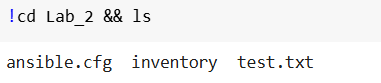
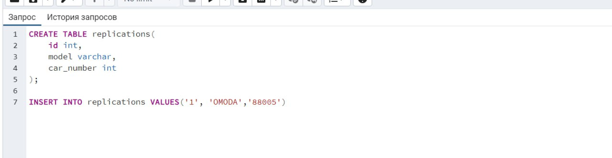
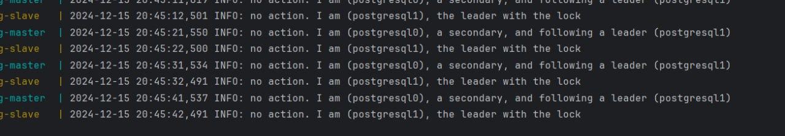
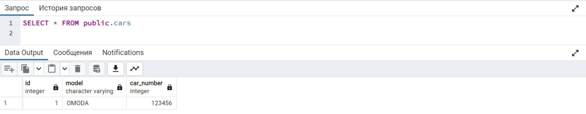
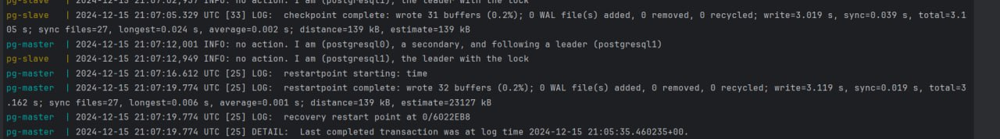
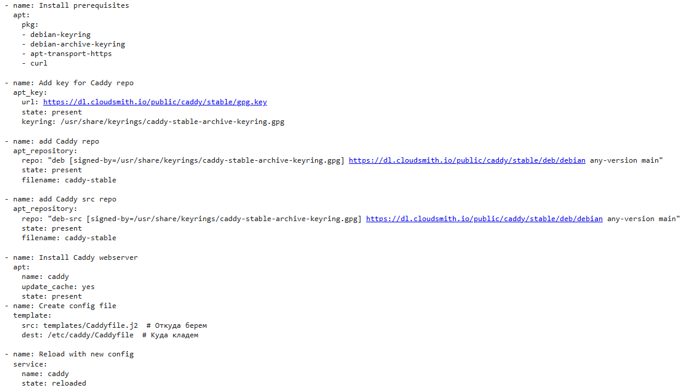

# Отчет по 3 лабе
Выполнили: Зеленин Денис, Чебан Евгений или Илья, Миша, Прокопец Семен

### Часть 1. Поднимаем Postgres

1. Создаем директорию для работы и все нужные файлы, после чего билдим контейнеры   

2. Проверяем, что контейнеры были запущены   

3. Проверяем, что `pg-master` стал лидером, а `pg-slave` — репликой   

### Часть 2. Проверяем репликацию

1. Подключаемся к базам данных через pgAdmin по localhost и их портам   

2. Cоздаем таблицу `my_first_replication` с тестовыми столбцами и данными   

3. Видим, что в `pg-slave` создалась таблица `my_first_replication`, которая содержит такие же данные   

4. Также пробуем что-то изменить в таблице у `pg-slave` и закономерно получаем ошибку, так как данные закрыты для редактирования   

5. Не работает

### Часть 3. Делаем высокую доступность

1. Успешно подключаемся к `haproxy`   

### Часть 4. Задание
1. выключаем сейчас pg_slave (нащшего мастера )  
2. видим что теперь наш мастер изменился  

3. зукапер заметил что то не так  

4. Haproxy поyял что что не так   

5. pg-master замечает отвалившийся коннект и пытается установить повторное подключение с мастером  

6. пробуем записать и запись работает  

# Ответы на вопросы

## Разница между директивами `expose` и `ports` в Docker Compose

### Директива `expose`
- Позволяет сделать порты доступными только для других контейнеров в той же сети Docker Compose. Это значит, что сервисы могут взаимодействовать друг с другом, но доступ извне (например, с хост-машины) не предоставляется.
- Используется для внутренней связи между контейнерами, что может быть полезно для повышения безопасности, так как порты не открываются для внешнего доступа.

### Директива `ports`
- Открывает указанные порты на хост-машине, что позволяет получать доступ к сервисам извне. Например, если вы укажете порт 8008 в `ports`, он будет доступен как на хосте, так и внутри сети контейнеров.
- Эта директива позволяет не только указать порты контейнера, но и их сопоставление с портами на хосте, что дает больше контроля над сетевыми настройками.

## Перезапуск проекта Docker Compose и пересборка образов

1. **При обычном перезапуске композ-проекта**:
   - Образ не будет пересобран автоматически. Docker Compose использует уже существующий образ, если он не изменился.

2. **Изменение файлов `postgresX.yml`**:
   - Изменения в конфигурации `postgresX.yml` также не приводят к пересборке образа. Эти изменения применяются сразу без необходимости пересборки.

3. **Изменение содержимого самого `Dockerfile`**:
   - Если вы измените `Dockerfile`, образ будет пересобран только при запуске Docker Compose с флагом `--build`. Если запускать без этого флага, будет использоваться старый образ.

Таким образом, для применения изменений в конфигурации или в самом Dockerfile необходимо учитывать использование соответствующих флагов и директив.
