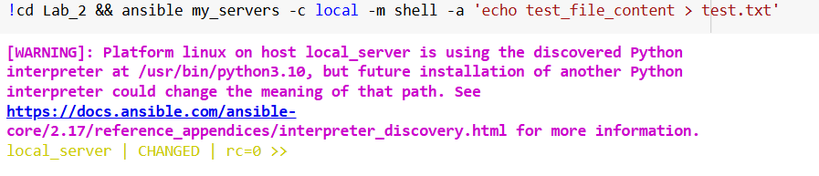
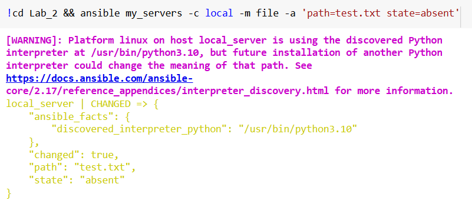
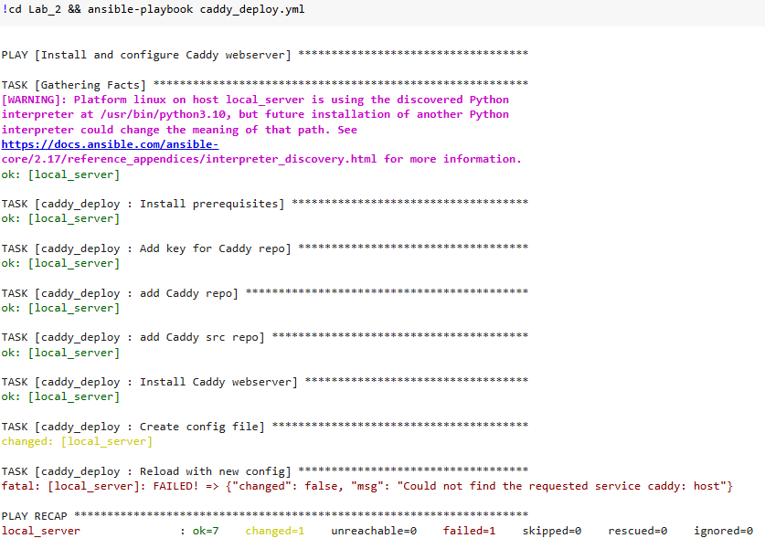

# Отчет по 2 лабе
Выполнили: Зеленин Денис, Чебан Евгений или Илья, Миша, Прокопец Семен

### Выполнение

1. Проверяю, что сервер с Ansible подключился к “клиенту”   

2. Создаю текстовый файл через shell   

3. Проверяю, что по нужному пути создался нужный файл с нужным именем и содержимым   

4. Удаляю файл через модуль file   

5. Запускаю playbook, ввожу в браузере имя своего домена и убеждаюсь, что тестовая страничка Caddy автоматически поднялась на подписанном сертификате с https  

###  Задания
1. Создаю playbook (file_manager.yml) и запускаю его, чтобы:
- Создать файл
- Записать в него данные
- Поменять содержимое 
- Удалить

Playbook:

Выполнение:
  

