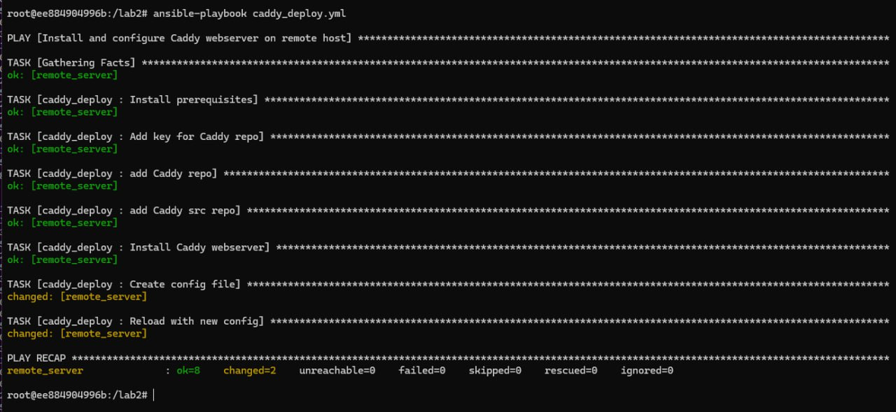
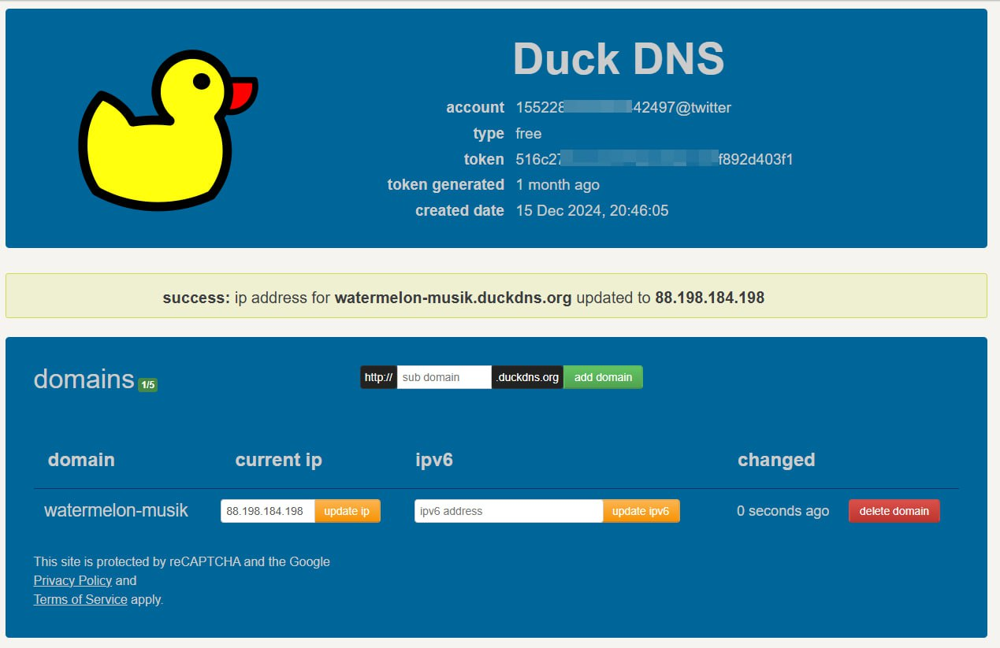
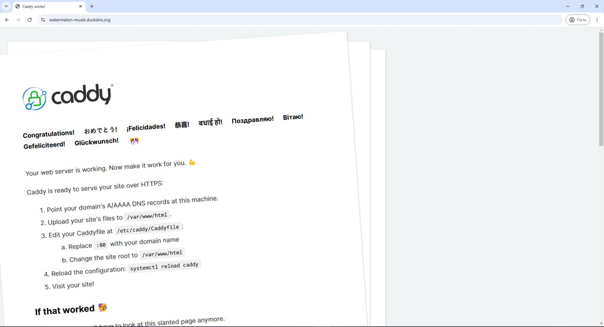
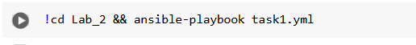
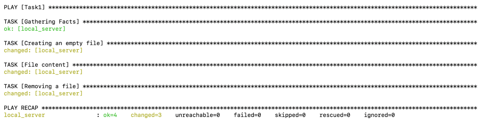

# Отчет по 2 лабе
Выполнили: Зеленин Денис, Чебан Евгений или Илья, Миша, Прокопец Семен

### Выполнение

1. Проверяю, что сервер с Ansible подключился к “клиенту”   

2. Создаю текстовый файл через shell   

3. Проверяю, что по нужному пути создался нужный файл с нужным именем и содержимым
4. Удаляю файл через модуль file
5. Запускаю playbook, ввожу в браузере имя своего домена и убеждаюсь, что тестовая страничка Caddy автоматически поднялась на подписанном сертификате с https  

## Задание 1
Запускаем:

вывод:

